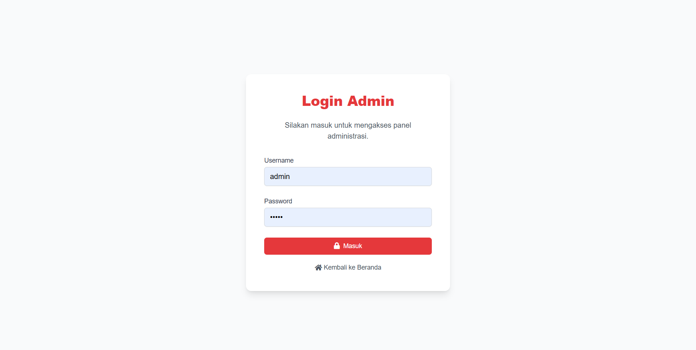
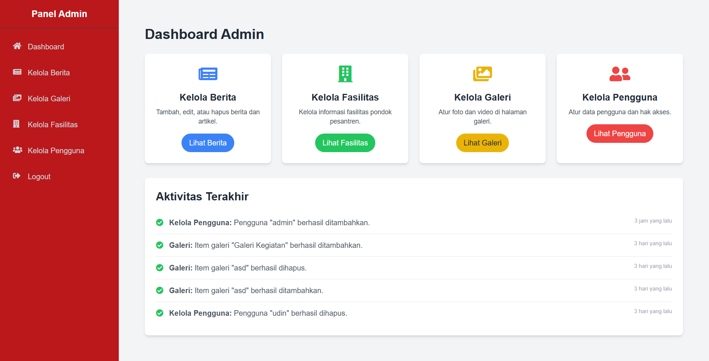

# 🌐 Website Pondok Pesantren Subulussalam

Website dinamis untuk Pondok Pesantren Subulussalam, dibangun dengan **PHP** dan konsep **Model-View-Controller (MVC)**, serta menggunakan **MySQL** sebagai database.  
Situs ini memiliki dua bagian utama: **Bagian Publik** untuk informasi umum, dan **Panel Admin** untuk pengelolaan konten.

---

## 📌 Bagian Publik
Menampilkan informasi untuk umum, meliputi:
- **Beranda (Home):** Ringkasan pesantren (nama, tahun berdiri 2002, nama pimpinan, statistik luas tanah, tenaga pendidik, dan santri).
- **Profil:** Sejarah, visi & misi, daftar pengurus, dan tenaga pendidik.
- **Berita:** Artikel dan kegiatan terbaru pesantren.
- **Galeri:** Foto dan video acara.
- **Fasilitas:** Daftar fasilitas pesantren.
- **Kontak:** Informasi kontak dan formulir pesan.

---

## 🔑 Panel Admin
Dilengkapi proteksi sandi untuk pengelolaan konten:
- Mengelola berita, galeri, fasilitas, dan data pengguna.
- Melihat aktivitas admin terbaru.

---

## 🛠 Teknologi yang Digunakan
- PHP Native (MVC)
- MySQL
- HTML, CSS, JavaScript
- Bootstrap / Tailwind (jika digunakan)
- PHP QR Code / Library lain (opsional sesuai kebutuhan)

---

## 📷 Screenshot

### Halaman Beranda

### Halaman Login

### Dashboard Admin

